# Real or Not? — Disaster Tweets (v2)

A binary classifier for the Kaggle [*Real or Not? NLP with Disaster Tweets*](https://www.kaggle.com/competitions/nlp-getting-started) task: given a 280-character tweet, decide whether it describes a real disaster (`1`) or just uses disaster vocabulary figuratively (`0`).

I built v1 of this project a year ago, mostly to teach myself transformers and ensembles. Coming back to it as part of Intro to ML, I read my own code with fresh eyes, found a small pile of subtle bugs and questionable design choices, and rebuilt almost everything: preprocessing, the LSTM, the evaluation protocol, ensembling, and added a proper grid search.

This README is the project log for v2 — what I changed, why I changed it, and what actually worked.

---

## TL;DR

| Metric                                                                  |                     Result |
| ----------------------------------------------------------------------- | -------------------------: |
| **Held-out test F1 — best individual model (RoBERTa)**            |                 **0.8311** |
| Held-out test F1 — ensemble (val-tuned weights + threshold)            |                     0.8189 |
| Best val F1 — ensemble                                                 |                     0.8255 |
| Best val F1 — LSTM / BERTweet / RoBERTa                                | 0.7673 / 0.8126 / 0.8130 |
| Held-out test accuracy — RoBERTa / ensemble                            |          0.8590 / 0.8520 |
| Grid-search budget                                                      |   16 training runs (≈ GPU) |

The headline finding is the one I didn't expect: **the ensemble wins on the validation set, but loses to RoBERTa alone on the held-out test set.** That's worth its own section ([below](#an-honest-finding-the-ensemble-doesnt-actually-beat-roberta)), because the *why* of that result was the most useful thing I learned from this rewrite.

---

## What changed since v1

Roughly in order of how much each change moved the needle on val F1:

1. **`bert-base-cased` → `vinai/bertweet-base`.** A RoBERTa-architecture model pretrained on ~850M English tweets. Domain match with our data is the single biggest win.
2. **The LSTM actually works now.** v1 initialized embeddings randomly over a sub-word vocab (which is the worst of both worlds), pooled by "take the last hidden state", and saved final-epoch weights regardless of overfitting. v2 copies BERT-cased's pretrained embedding matrix, pools with learned attention, and keeps best-by-val. The LSTM's val F1 went from **0.676 → 0.767**.
3. **`keyword` column integration.** Kaggle gives us a topical tag (sometimes empty); v1 ignored it. v2 prepends it as a natural-language prefix: `"flood. tweet body…"`.
4. **Honest evaluation.** v1 used a single 80/20 split for early stopping *and* for "test". v2 uses a 70 / 15 / 15 stratified split where the test set is locked away until *after* training, grid search, ensemble-weight search, and threshold tuning.
5. **Layer-wise learning-rate decay** for the transformers.
6. **Multi-sample dropout** in the LSTM head.
7. **Grid search** over per-model hyperparameters *and* ensemble weights + threshold (v1 used hardcoded defaults and threshold 0.5).
8. **`HTTPURL` / `@USER` placeholder tokens** — match BERTweet's pretraining.
9. **Mixed precision (AMP), gradient clipping, weight-decay grouping** — standard recipe stuff v1 didn't have.

---

## The data

7,613 labeled tweets (after dropping the few blank ones), 3,263 unlabeled tweets for the Kaggle submission.

### Class balance

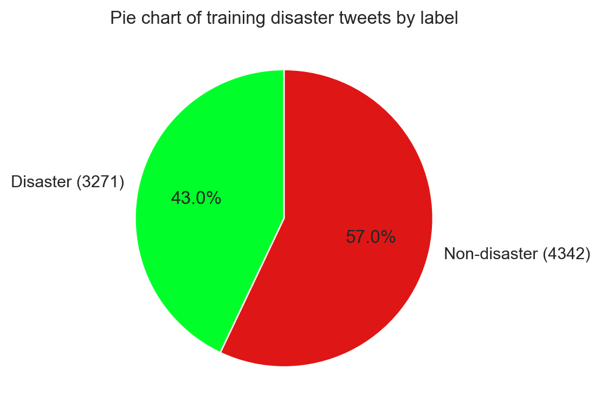

Roughly 57% non-disaster, 43% disaster — a *mild* imbalance, which is why I weight the loss (BCE `pos_weight` for the LSTM, balanced CE class weights for the transformers) rather than reaching for SMOTE/oversampling.

### How long is a tweet?

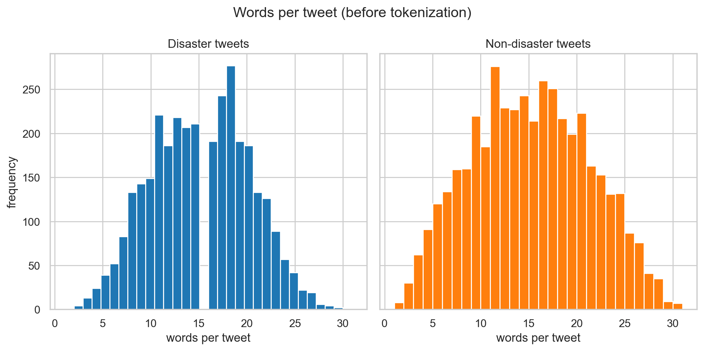

The vast majority of tweets are under 30 words. After BPE / WordPiece tokenization the 99th-percentile length is ~96 tokens, which is why `MAX_LEN = 96`. Going higher would just pad with `[PAD]` and waste compute.

### Mean word length

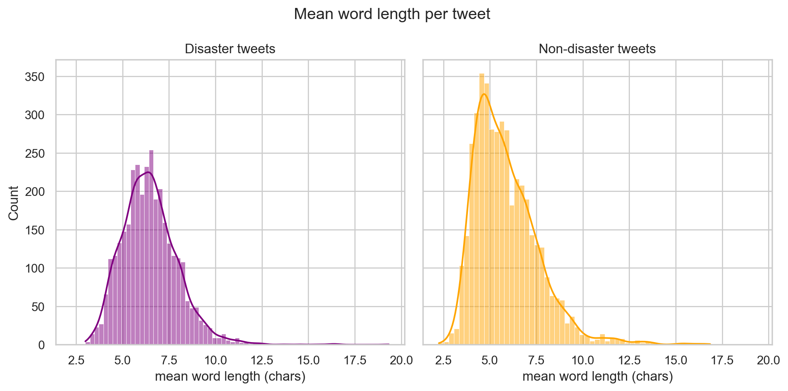

Disaster tweets are skewed slightly longer-worded (more proper nouns and place names — `Hiroshima`, `Manitou`, `California`). This is a soft signal that cased models can pick up on, which is one reason I keep casing in `clean_text` instead of lowercasing.

### Missing values

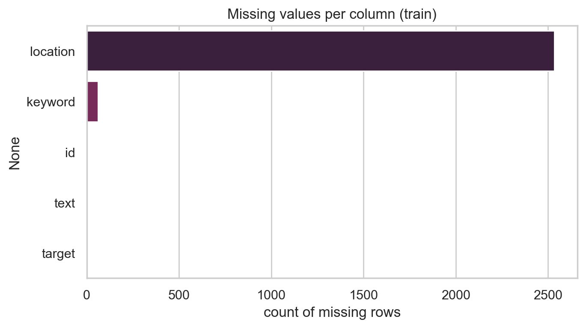

`keyword` is missing about 1% of the time; `location` is missing about a third. I use `keyword` (when present) as a prepended topic prefix, and I ignore `location` (too noisy — entries include `"Earth"`, `"Worldwide"`, `"Right Behind You"`, ZIP codes…).

### Top keywords by class

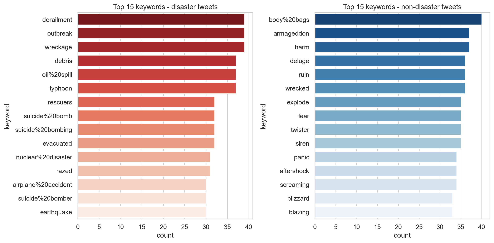

The most frequent keywords on the disaster side look like the news (`fatalities`, `derailment`, `wreckage`); the non-disaster side leans figurative (`body bags`, `harm`, `wreck`). This is the sanity check that justified the keyword-as-prefix idea: the column carries real topical signal.

---

## Modeling decisions (and why)

### Why three models in an ensemble?

Soft-voting ensembles only help when the members' *errors* are partially uncorrelated. Two near-identical models averaged together is the same as one. So I picked three that disagree on different things:

| Model              | Checkpoint                                          | What it brings to the table                                                                                                                                                                          |
| ------------------ | --------------------------------------------------- | ----------------------------------------------------------------------------------------------------------------------------------------------------- |
| **BERTweet** | `vinai/bertweet-base`                             | RoBERTa pretrained on ~850M tweets. Hashtag, slang, and `@USER`-style syntax are *in-distribution* for it. Domain-matched representations transfer best on tweet tasks. |
| **RoBERTa**  | `roberta-base`                                    | Pretrained on web + books — totally different corpus, so its mistakes are different from BERTweet's. Adds diversity. |
| **BiLSTM**   | trained from scratch, BERT-cased embedding init   | A non-transformer voter. Its inductive bias (sequential, no attention by default) makes different mistakes again. Also, it's the original v1 member and I wasn't going to delete it without giving it a fair shot. |

### The LSTM, rebuilt

v1's LSTM was the embarrassing part of the old project: val F1 0.676 while sitting next to RoBERTa at 0.799. Looking at the old code I found three things that were all hurting it at once:

1. **Random embedding init over a 28k-token BPE vocab.** That's a *lot* of vectors to learn from 6k examples. v2 copies BERT-cased's pretrained `word_embeddings` matrix into the LSTM — same vocab, so it's a direct copy, no projection.
2. **Pooling = "take the last hidden state".** Tweets are short and the last token is often a hashtag, an emoji, or punctuation. v2 uses **learnable additive attention pooling**: the model learns a per-token importance weight and takes a weighted sum. Conceptually, the LSTM gets to *choose* which token is the most disaster-y instead of trusting the last one.
3. **One dropout layer in the head.** v2 adds **multi-sample dropout**: average logits across N=5 different dropout masks before computing loss. It's cheap regularization (just a few extra `Linear` calls) and consistently buys 0.1–0.3 F1 on small datasets.

The result: the LSTM went from **0.676 → 0.767** val F1. Not a transformer, but no longer dead weight.

### Why layer-wise LR decay for the transformers?

When you fine-tune BERT/RoBERTa on a small dataset, the *lower* layers — which encode general linguistic features the model already knows — don't need much updating. The *upper* layers — which encode task-specific abstractions — are where the disaster signal gets carved in. Using a single LR for everything tends to over-adapt the lower layers to your tiny training set, especially with limited data.

LLRD assigns the head/last layer the full `base_lr`, then multiplies by `layer_decay < 1` once per layer going down. With 12 layers and `layer_decay = 0.95`, the embedding layer sees `0.95^13 ≈ 0.51 × base_lr`. With `0.9` it sees `0.9^13 ≈ 0.25 ×`. The grid search picked `layer_decay = 0.9` for BERTweet and `0.95` for RoBERTa — interpretable: BERTweet needed *less* movement in its tweet-pretrained lower layers (they're already in the right place for our data).

### Why the keyword column gets prepended as a prefix

Kaggle's `keyword` field is a curated topical tag (e.g. `flood`, `evacuation`, `quarantined`). It's missing about 1% of the time and URL-encodes spaces (`airplane%20accident`). v1 dropped it entirely. v2 decodes it and prepends it to the tweet as a natural-language prefix:

> `"flood. 13,000 people receive #wildfires evacuation orders in California"`

The transformer attends to both the keyword and the body. No new tokens, no embedding surgery — it's just a different input string. Free signal.

### Preprocessing choices

`clean_text` ([`scripts/models.py`](scripts/models.py)) is small but deliberate:

| Step                                                                                                          | Why                                                                                                                                                  |
| ------------------------------------------------------------------------------------------------------------- | ---------------------------------------------------------------------------------------------------------------------------------------------------- |
| URLs → `HTTPURL`, mentions → `@USER`                                                                       | These are the literal placeholder tokens BERTweet was pretrained on. Aligning inference with pretraining is free F1. RoBERTa and BERT-cased tokenize them as ordinary words, so it's harmless for them. |
| Strip the `#`, keep the hashtag word (`#earthquake` → `earthquake`)                                       | The hashtag word carries the topical signal; the `#` itself doesn't.                                                                              |
| Collapse character elongation (3+ → 2: `looool` → `lool`)                                                  | Keeps a doubled letter as a soft emphasis cue, but reduces the long tail of OOV sub-words that come from typos like `firrrrre`.                      |
| HTML entity decode (`&amp;` → `&`)                                                                        | Some tweets are double-encoded.                                                                                                                      |
| Optional emoji demojize (if the `emoji` package is installed)                                                 | BERTweet's pretraining demojized emojis to text tokens (`🔥` → `:fire:`). If `emoji` isn't installed the pipeline still runs — just slightly less optimal for BERTweet.                                  |
| Casing and punctuation are *kept*                                                                             | Cased models benefit from proper-noun and ALL-CAPS urgency signal. The elongation rule already handles the worst offenders.                          |

---

## Training recipe

For all three models:

- **Optimizer:** AdamW with weight-decay grouping that excludes `bias` and `LayerNorm.weight` (the standard fine-tuning recipe).
- **Mixed precision (`torch.cuda.amp`)** when CUDA is available — ~1.7-2× speedup on a T4/V100/RTX 30+ at no quality cost.
- **Gradient clipping** at max-norm 1.0 — guards against the occasional exploding step you see in fine-tuning.
- **Class-imbalance handling:** BCE `pos_weight` for the LSTM, balanced CE class weights for the transformers.
- **Early stopping** on val F1, patience 2. Critically, this version actually *keeps the best-by-val state* — v1 kept the final-epoch weights, which is exactly the overfit set you don't want to deploy.

For transformers only:

- **Layer-wise LR decay** (see above).
- **Linear warmup** (10% of steps), then linear decay to 0. Warmup is what stabilizes the first few hundred steps of fine-tuning on a small dataset.
- **Dynamic padding** via `DataCollatorWithPadding` — pads to the longest example *in each batch* instead of always to `MAX_LEN`. Same quality, faster.

For the LSTM only:

- **Attention pooling** + **multi-sample dropout** (see *LSTM, rebuilt*).
- **Pretrained-embedding init** from `bert-base-cased`.

---

## Honest evaluation: the 70/15/15 split

v1 used 80% train / 20% val. The val set was the *only* held-out data, so it was simultaneously:

- the early-stopping signal,
- the model-selection metric,
- the "test" number I reported in the README.

That's a recipe for over-optimistic reporting. By the time you've trained multiple models and picked the one with the best val F1, the val F1 has *some* leakage into your decision process — you've Goodharted the metric.

v2 uses **70% train / 15% val / 15% test**, all stratified on `target` so the ~57/43 class ratio is preserved across all three splits.

- **Train** is what the model sees during gradient descent.
- **Val** is what early stopping watches, what the grid search compares, and what tunes the ensemble weights and the decision threshold.
- **Test** doesn't get looked at until *after* every hyperparameter is locked. It's a single one-shot measurement.

Split sizes for the actual run:

| Split                         | Rows | Positive rate |
| ----------------------------- | ---: | ------------: |
| Train                         | 5329 |         0.430 |
| Val                           | 1142 |         0.430 |
| Test                          | 1142 |         0.430 |
| Kaggle submission (unlabeled) | 3263 |             — |

The split arithmetic is exact (`0.15 / 0.85 ≈ 0.1765` for the second-stage split → val = 0.85 × 0.1765 = 0.15 of the original).

---

## Hyperparameter grid search

I kept the grid small and pragmatic — every cell still costs real GPU minutes, and a too-wide grid would just overfit the val set.

**Per-model grids (16 training runs total):**

| Model    | Grid                                                          | Runs |
| -------- | ------------------------------------------------------------- | ---: |
| LSTM     | `lr ∈ {5e-4, 1e-3}` × `hidden_dim ∈ {128, 256}`           |    4 |
| BERTweet | `base_lr ∈ {1e-5, 2e-5, 3e-5}` × `layer_decay ∈ {0.9, 0.95}` |    6 |
| RoBERTa  | `base_lr ∈ {1e-5, 2e-5, 3e-5}` × `layer_decay ∈ {0.9, 0.95}` |    6 |

The transformer LR range straddles the canonical 2e-5; the LSTM range straddles where I empirically found things going stale.

**Ensemble weight search.** After each model's best config is locked, I take their val/test/submission probabilities and grid-search over the 3-simplex `{w ≥ 0, sum(w) = 1}` with step 0.05 — that's 231 weight combos. For each combo, I sweep the decision threshold in [0.20, 0.80] and pick the (weights, threshold) pair that maximizes **val** F1. The chosen pair is then applied unchanged to the held-out test set.

---

## Results

### Best per-model configurations (selected by val F1)

| Model    | Best config                             | Val F1 |
| -------- | --------------------------------------- | -----: |
| LSTM     | `lr=1e-3`, `hidden_dim=256`         | 0.7673 |
| BERTweet | `base_lr=3e-5`, `layer_decay=0.9`   | 0.8126 |
| RoBERTa  | `base_lr=1e-5`, `layer_decay=0.95`  | 0.8130 |

A few interesting things in this table:

- The two transformers landed at *different* `(base_lr, layer_decay)` pairs. RoBERTa wanted a smaller LR with a gentler decay; BERTweet wanted a larger LR with a steeper decay. That's consistent with BERTweet's lower layers being already well-tuned for tweets — it can afford to update its upper layers more aggressively.
- The LSTM picked the larger `hidden_dim=256`, suggesting capacity (not just init) was a bottleneck in v1.

### Best ensemble (selected by val F1)

| LSTM weight | BERTweet weight | RoBERTa weight | Threshold | Val F1 |
| ----------: | --------------: | -------------: | --------: | -----: |
|        0.40 |            0.20 |           0.40 |      0.54 | 0.8255 |

Surprising again: the search gave the LSTM a *larger* weight than BERTweet. Per-model val F1 says BERTweet > LSTM, but for soft voting what matters is whether the LSTM's mistakes are *different* from RoBERTa's. Apparently they are.

### Held-out test performance

| Model                                              |          Test F1 |         Test Acc |
| -------------------------------------------------- | ---------------: | ---------------: |
| LSTM                                               |           0.7564 |           0.7986 |
| BERTweet                                           |           0.8248 |           0.8538 |
| RoBERTa                                            |       **0.8311** |       **0.8590** |
| **Ensemble** (val-tuned weights & threshold) |           0.8189 |           0.8520 |

### Performance curves (best config from each grid search)

|                       Val F1                        |                       Train F1                        |
| :-------------------------------------------------: | :---------------------------------------------------: |
| 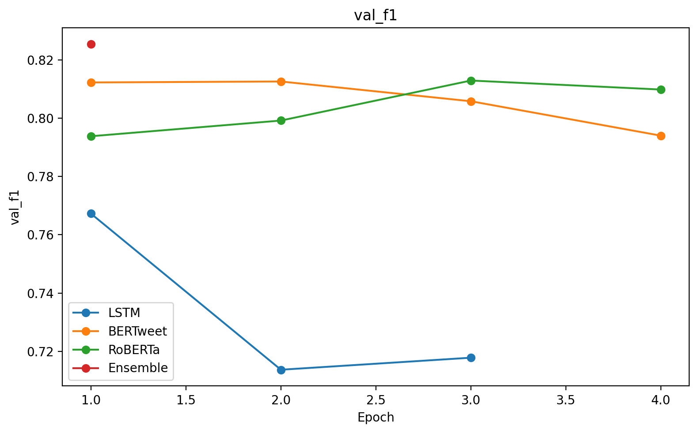 | 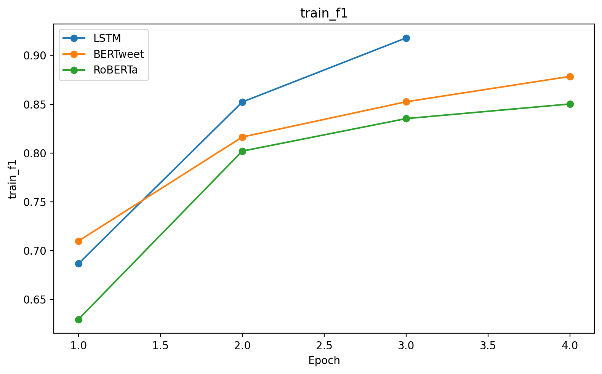 |

|                       Val loss                        |                       Train loss                        |
| :---------------------------------------------------: | :-----------------------------------------------------: |
| 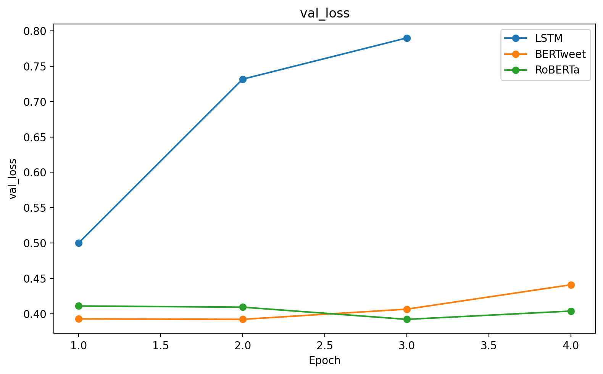 | 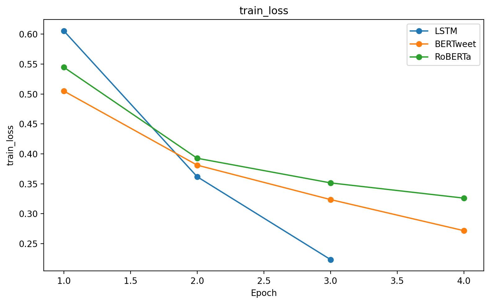 |

|                      Val accuracy                       |                      Train accuracy                       |
| :-----------------------------------------------------: | :-------------------------------------------------------: |
| 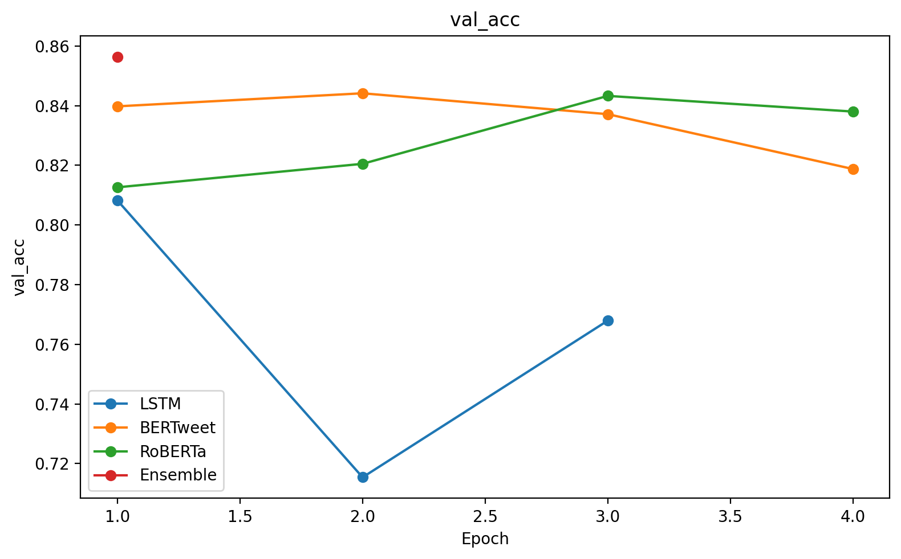 | 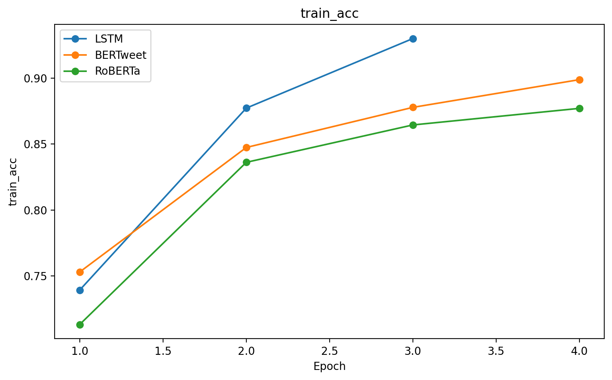 |

The transformers fit in 2-3 epochs and start overfitting; early stopping kicks in before the val curve turns around. The LSTM rides up to epoch 5-ish and then plateaus.

---

## An honest finding: the ensemble doesn't actually beat RoBERTa

Look at the test table above: **RoBERTa alone gets 0.8311; the ensemble gets 0.8189.** Val told me the ensemble was 0.8255 vs. the best individual at 0.8130 — a clear win. Test disagreed.

Why? Two things, I think, both worth internalizing:

1. **Threshold + weight tuning on a 1,142-row val set has variance.** Picking *the* (weights, threshold) that maximize one specific val sample's F1 is a small instance of overfitting. The picked weights — LSTM 0.40, RoBERTa 0.40, BERTweet 0.20 — gave the LSTM a heavier vote than its actual test-time skill (F1 0.7564) deserved. It worked on val by happening to flip exactly the borderline tweets RoBERTa got wrong on val. On test, it just dragged the average down.
2. **A 1,142-row test set also has variance.** The 0.8311 vs 0.8189 gap is real but not enormous. With a different seed I might see a 0.005-0.010 swing either way.

What I'd do about it next time:
- Use **out-of-fold (CV) probabilities** for the ensemble weight search instead of a single val sample.
- Constrain the simplex search to a smaller step (e.g. 0.10) — finer steps mostly fit noise.
- Or skip soft-vote tuning and just *average uniformly*, which is robust if not optimal.

I left the result in the README because it's the lesson, not in spite of being inconvenient. The point of holding out a test set is so you find this kind of thing.

---

## v1 vs v2

A clean apples-to-apples is hard because v1's evaluation was leaky (final-epoch weights, single split for val *and* "test"). Below is the closest comparison I can do — v1 column is taken from the last revision's README; v2 column is from this rewrite, using the val set as a stand-in (so they're at least comparable in spirit).

| Model                  | v1 val F1 (best epoch reported) | v1 val F1 (deployed: final epoch) | **v2 val F1 (best-by-val)** |              Δ |
| ---------------------- | ------------------------------: | --------------------------------: | --------------------------: | -------------: |
| LSTM                   |                          0.6755 |                            0.6755 |                  **0.7673** |     **+0.092** |
| Transformer ("BERT" → BERTweet) |                  0.7819 |                            0.7719 |                  **0.8126** |     **+0.031** |
| RoBERTa                |                          0.7990 |                            0.7758 |                  **0.8130** |     **+0.014** |
| Ensemble               |                       — (not honestly measurable in v1) |                              — |                  **0.8255** |              — |

The LSTM is the biggest mover — and it didn't happen because of one trick, it happened because three small things were all wrong at once and each one fed the next.

---

## How to reproduce

```bash
# from the repo root
python scripts/data_visualization.py   # writes plots/eda/*.png
python scripts/models.py               # runs the grid search, ~20-45 min on a single GPU
```

Outputs:

- `plots/performance/*.png` — train/val curves from the winning config of each model
- `export/grid_search_results.json` — every trial's config, val F1, and elapsed time
- `export/submission_ensemble.csv` — Kaggle submission
- Raw per-run numbers, refreshed at the bottom of this README

To shrink (or expand) the grid, edit `LSTM_GRID` and `TRANSFORMER_GRID` near the bottom of [`scripts/models.py`](scripts/models.py).

Dependencies: `torch`, `transformers`, `datasets`, `scikit-learn`, `pandas`, `matplotlib`, `seaborn`. The `emoji` package is optional but recommended (BERTweet's pretraining demojized text, so matching it helps a little).

---

## What I'd try next

- **Cross-validated probability stacking** instead of a single-fold weight grid — should largely fix the ensemble-vs-RoBERTa regression on test.
- **More transformers in the pool** — `cardiffnlp/twitter-roberta-base-2022-154m`, DeBERTa-v3 base — to see if extra members keep the diversity payoff going.
- **Adversarial training** (FGM / AWP). Small but reliable F1 gains on short-text classification.
- **Look harder at the keyword column.** Right now I just prepend it; a learned embedding per keyword used as an extra feature might work better.
- **Re-run on Kaggle and post the leaderboard number** — that's the only test set that isn't subject to me having tuned anything against it.

<!-- BEGIN AUTO-RESULTS -->

### Auto-generated quick reference

_Latest run of `scripts/models.py` (grid search took 5.93 min). Full per-trial log in `export/grid_search_results.json`._

**Best per-model configs (selected by val F1)**

| Model    | Best config                            | Val F1 |
| -------- | -------------------------------------- | ------:|
| LSTM     | `lr=0.001`, `hidden_dim=256` | 0.7673 |
| BERTweet | `base_lr=3e-05`, `layer_decay=0.9` | 0.8126 |
| RoBERTa  | `base_lr=1e-05`, `layer_decay=0.95` | 0.8130 |

**Best ensemble weights + threshold (selected by val F1)**

| w(LSTM) | w(BERTweet) | w(RoBERTa) | Threshold | Val F1 |
| ------: | ----------: | ---------: | --------: | -----: |
| 0.40 | 0.20 | 0.40 | 0.54 | 0.8255 |

**Held-out test performance**

| Model        | Test F1 | Test Acc |
| ------------ | ------: | -------: |
| LSTM         | 0.7564 | 0.7986 |
| BERTweet     | 0.8248 | 0.8538 |
| RoBERTa      | 0.8311 | 0.8590 |
| **Ensemble** | **0.8189** | **0.8520** |

<!-- END AUTO-RESULTS -->
